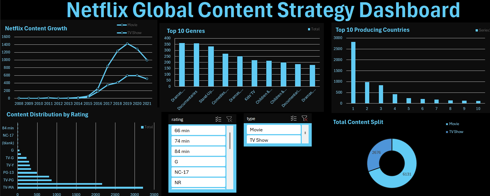

# Advanced Excel Data Analytics Portfolio

Welcome to my Microsoft Excel analytics portfolio! This repository showcases my ability to clean raw data, utilize advanced formulas, build dynamic PivotTables, and design highly interactive, executive-level dashboards.

---

## 1. Global Bike Sales Dashboard
An interactive dashboard analyzing the demographic and financial factors that influence customer bike purchases. 

* **Files:** `bike_buyers project.xlsx`, `bike_buyers.csv`
* **Skills Showcased:** Data Cleaning, PivotTables, Interactive Slicers, Demographic Analytics.

---

## 2. Netflix Content Strategy Analytics
A comprehensive analysis of the global Netflix content catalog, exploring trends in Movies vs. TV Shows, geographical distribution, and historical release patterns. I designed this dashboard in two distinct UI themes to demonstrate data visualization versatility.

### Standard Theme

### Blue UI Theme

* **Files:** `Netflix_Dashboard.xlsx`, `netflix_titles.csv`
* **Skills Showcased:** Advanced Excel Functions, Data Formatting, Time-Series Analysis, Strategic UI/UX Dashboard Design.

---

### Additional Files Included:
* `index.html` & `favicon.png` - Web portfolio integration files.
